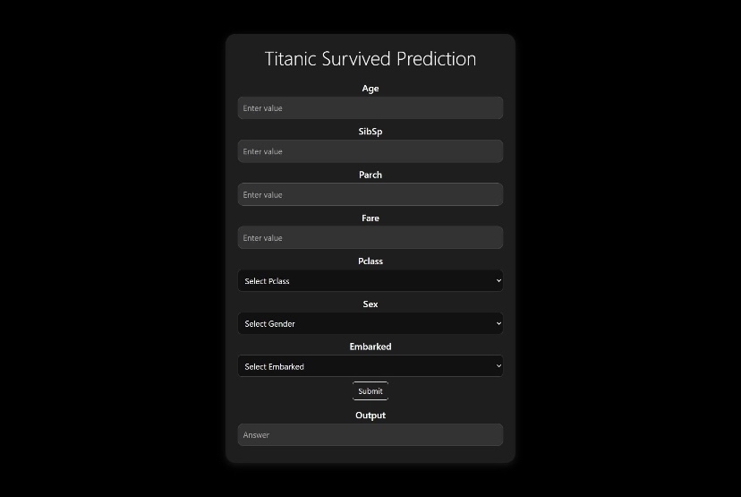
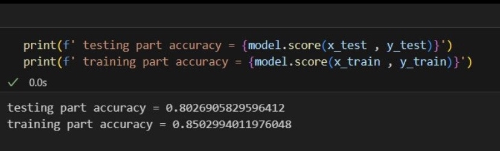
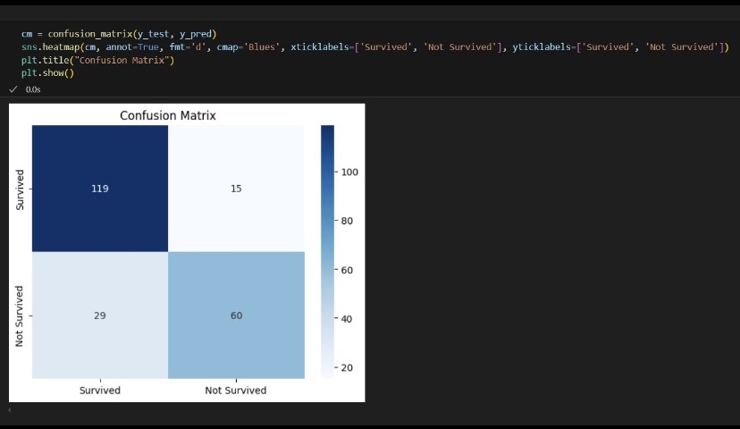
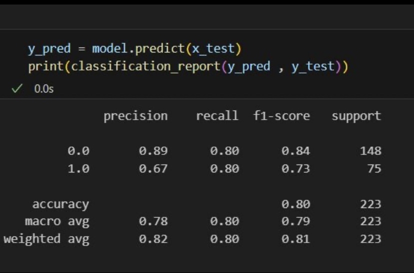

# 🚢 Titanic Survival Prediction Using Machine Learning

A **beginner-friendly machine learning classification project** that predicts whether a passenger survived the Titanic disaster based on key features such as age, gender, class, and fare.

---

## 🎯 Features

- 🌲 **Random Forest Classifier** for survival prediction  
- 🧹 Complete ML pipeline:
  - Missing value handling  
  - Outlier removal  
  - Encoding categorical features  
  - Feature scaling  
- 📊 Model evaluation using:
  - Accuracy Score  
  - Confusion Matrix  
  - Classification Report  
- 🖥️ Simple frontend interface for making predictions  

---

## 🖼️ Visuals

### Frontend View
📸 User interface where Titanic survival predictions can be made easily  

### Accuracy Scores (Train vs Test)
📊 Evaluating model performance and checking overfitting  

### Confusion Matrix
📉 Visualization of correct vs incorrect predictions  

### Classification Report
📝 Precision, Recall, and F1-Score for each class  

---

## 🧠 Tech Stack

- **Language:** Python  
- **Machine Learning:** Scikit-learn  
- **Model:** Random Forest Classifier  
- **Data Processing:** Pandas, NumPy  
- **Visualization:** Matplotlib, Seaborn  
- **Frontend:** HTML, CSS  

---

## 📚 Learning Outcomes

- Understood **classification workflows** in machine learning  
- Gained hands-on experience with **data preprocessing**  
- Learned to evaluate classifiers using **multiple metrics**  
- Improved understanding of **overfitting vs generalization**  
- Built confidence in structuring end-to-end ML projects  

---

## 🚀 About

This project strengthened my foundation in **machine learning classification** and motivated me to continue building real-world ML applications.
